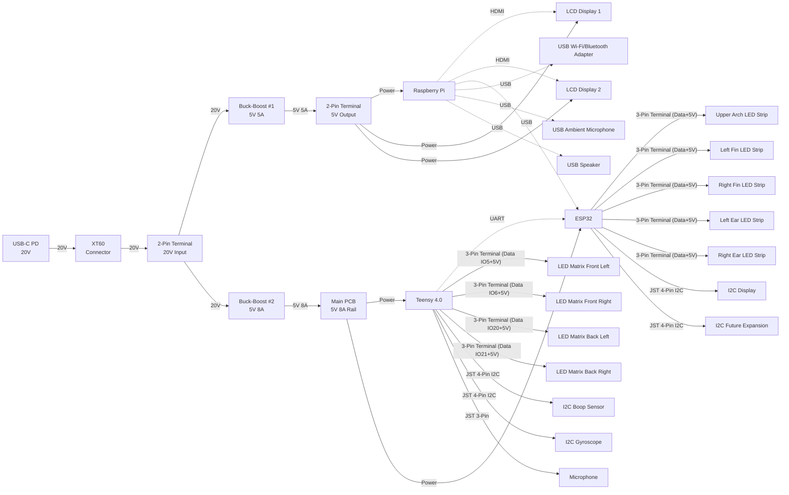

# Protogen Controller Circuit Diagram

This diagram shows the complete power distribution and communication architecture of the Protogen controller system.

## System Architecture

## Power Distribution Summary

### Input Power
- **Source**: USB-C Power Delivery (PD)
- **Voltage**: 20V
- **Connector Chain**: USB-C → XT60 → 2-Pin Terminal Block

### Buck-Boost Converters

#### Converter #1 (5V 5A Rail)
- **Input**: 20V from main terminal block
- **Output**: 5V @ 5A (25W max)
- **Powers**:
  - Raspberry Pi
  - 2× LCD Displays
- **Connection**: Via 2-pin terminal block

#### Converter #2 (5V 8A Rail)
- **Input**: 20V from main terminal block
- **Output**: 5V @ 8A (40W max)
- **Powers**:
  - Main PCB
  - Teensy 4.0
  - ESP32
  - All LED matrices and strips (through microcontrollers)

## Communication Architecture

### Inter-Device Communication
| From | To | Protocol | Purpose |
|------|-----|----------|---------|
| Raspberry Pi | LCD Display 1 | HDMI | Video output |
| Raspberry Pi | LCD Display 2 | HDMI | Video output |
| Raspberry Pi | ESP32 | USB | Data communication/control |
| Raspberry Pi | Wi-Fi/Bluetooth Adapter | USB | Wireless connectivity |
| Raspberry Pi | Ambient Microphone | USB | Audio input |
| Raspberry Pi | Speaker | USB | Audio output |
| Teensy 4.0 | ESP32 | UART | Inter-microcontroller communication |

### Raspberry Pi USB Peripherals
| Quantity | Connector Type | Device | Purpose |
|----------|----------------|---------|---------|
| 1× | USB | ESP32 | Microcontroller communication/control |
| 1× | USB | Wi-Fi/Bluetooth Adapter | Wireless connectivity |
| 1× | USB | Ambient Microphone | Environmental audio input |
| 1× | USB | Speaker | Audio output |

### Teensy 4.0 Peripherals
| Quantity | Connector Type | Device | Purpose |
|----------|----------------|---------|---------|
| 4× | 3-Pin Terminal Block | LED Matrices | Display control (Data + 5V + GND) |
| 2× | JST 4-Pin | I2C Devices | Sensor/peripheral bus |
| 1× | JST 3-Pin | Microphone | Audio input |

### ESP32 Peripherals
| Quantity | Connector Type | Device | Purpose |
|----------|----------------|---------|---------|
| 5× | 3-Pin Terminal Block | LED Strips | Lighting control (Data + 5V + GND) |
| 2× | JST 4-Pin | I2C Devices | Display interface and future expansion |

## Connector Specifications

### Terminal Blocks
- **2-Pin**: Power distribution (VCC + GND)
- **3-Pin**: LED control (Data + VCC + GND) or single-wire protocols

### JST Connectors
- **JST 4-Pin**: I2C bus (SDA, SCL, VCC, GND)
- **JST 3-Pin**: UART/Serial or single signal (TX/RX/Signal + VCC + GND)

## Notes

- All LED matrices and LED strips are powered through the 5V 8A rail via their respective microcontrollers
- Total system power budget: ~65W (25W + 40W from both converters)
- Communication links (HDMI, USB, UART) are shown with dotted lines in the diagram
- Power connections are shown with solid lines
- The main PCB houses both the Teensy 4.0 and ESP32, sharing the 5V 8A power rail
- Raspberry Pi has 4 USB devices connected (ESP32, Wi-Fi/Bluetooth adapter, ambient microphone, speaker)